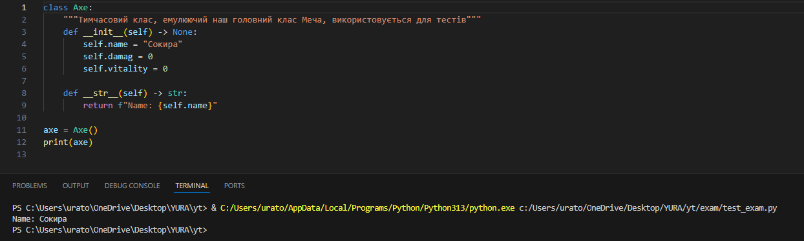

## Завдання на екзамен
15. У файлі axe.py створіть метод стрічкового представлення обєкту (при застосування функції print до обєкту) та який буде повертати стрічку де буде розкриватись атрибут name 
- результат запуску за скріншоті  

